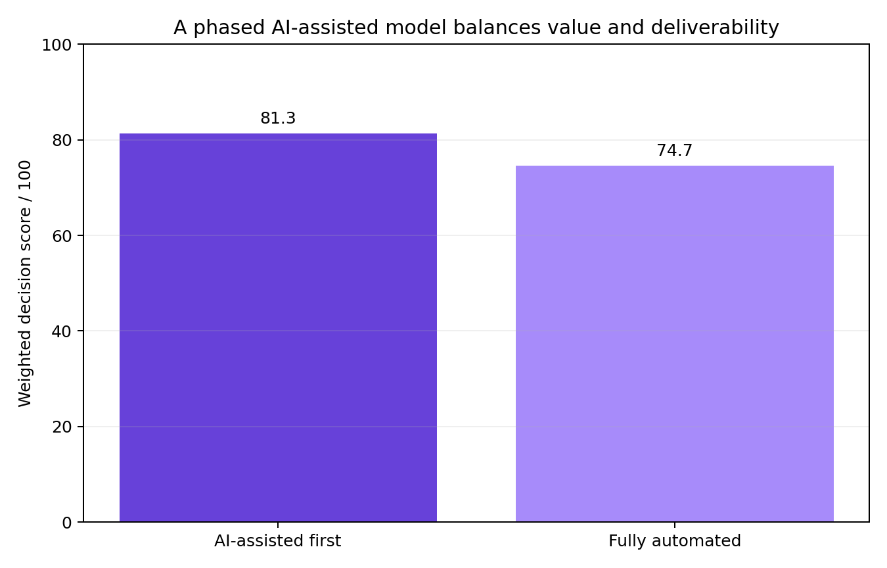
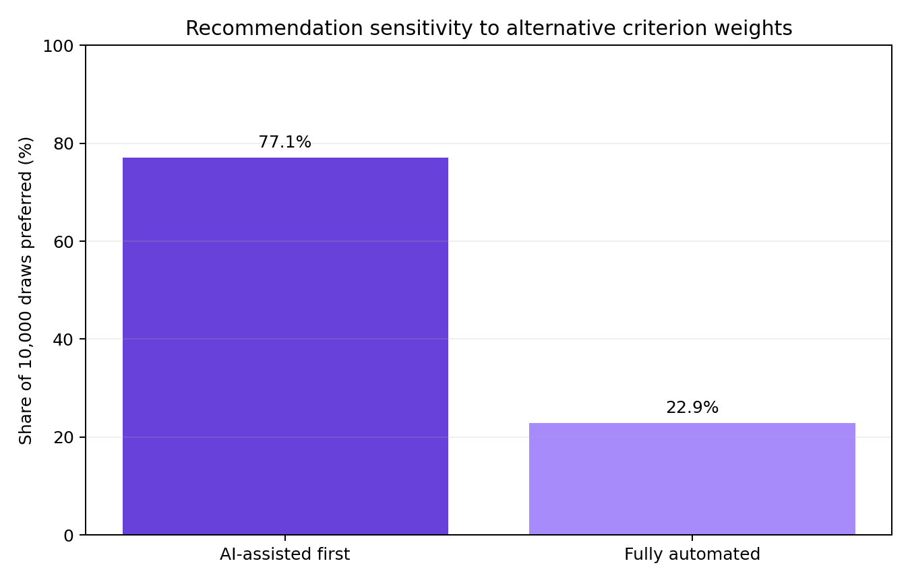

# VFX Workflow Automation Decision Model

**A business-process and MCDA framework for reducing manual scheduling and reporting work in a visual-effects production pipeline.**

> Portfolio context: this repository develops an MSc group consulting case for Fix Visual Effects Ltd into a reproducible decision model. Commercially sensitive source documents and the submitted report are excluded.

## Decision question

Should a growing VFX studio introduce an AI-assisted scheduling layer first, or move directly to a fully automated production-management architecture?

## Recommendation

Adopt the **AI-assisted model as the controlled first phase**, while designing the data architecture for fuller automation later. The fixed-weight model scores the phased option higher because implementation feasibility, creative flexibility and integration risk offset the target-state benefits of full automation.

The recommendation is deliberately conditional: once data quality, API integration, staff adoption and model governance are proven, the fully automated architecture becomes a credible next-stage option.





## Diagnosis

The original workflow joined Flow Production Tracking with manually maintained JobMatrix and Schedule spreadsheets. Weekly reporting required repeated export, checking, reformatting and producer commentary. The core constraint was therefore not a lack of creative flexibility but delayed and duplicated **information flow**.

| Current pain point | Operational effect | Required capability |
| --- | --- | --- |
| Manually synchronised schedules | Stale status and downstream delays | Single source of truth |
| Manual workload monitoring | Uneven artist allocation | Capacity-aware scheduling |
| Repeated weekly report assembly | Administrative effort and error risk | Automated client reporting |
| Revision-driven changes | Fragile dependency chains | Dynamic rescheduling |
| Disconnected tools | Weak portfolio visibility | Governed integrations and dashboards |

## Portfolio enhancement

The original case compared two architectures qualitatively. This repository adds a transparent weighted decision matrix and 10,000-draw weight-sensitivity test. The scores are **analyst judgements derived from the case SWOT**, not measured vendor performance. They are editable in `data/reference/decision_matrix.csv`.

## Skills demonstrated

- As-is/to-be process analysis
- Bottleneck and dependency-chain diagnosis
- Multi-criteria decision analysis
- Sensitivity testing and recommendation under uncertainty
- Change sequencing, controls and benefits measurement

## Reproduce

```bash
python -m venv .venv
source .venv/bin/activate
pip install -r requirements.txt
python analysis.py
python -m unittest discover -s tests -v
```

See [methodology](docs/METHODOLOGY.md), [implementation roadmap](docs/IMPLEMENTATION.md), [asset notice](ASSET_NOTICE.md), and [GitHub setup](GITHUB_SETUP.md).
